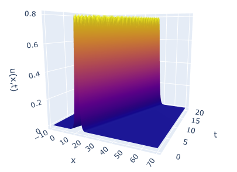
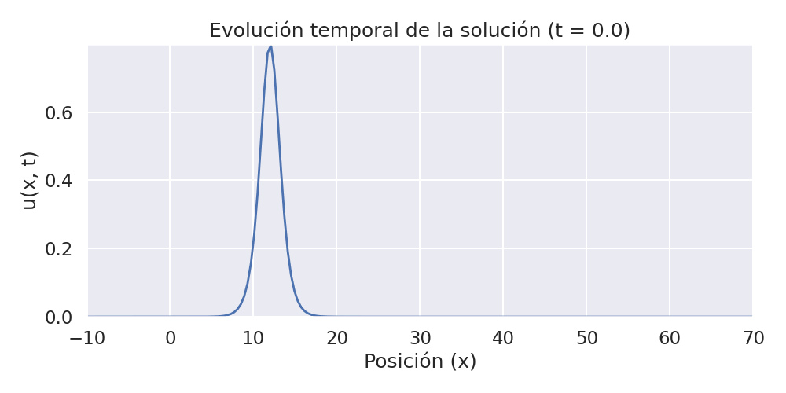
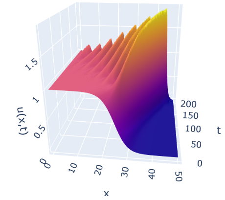
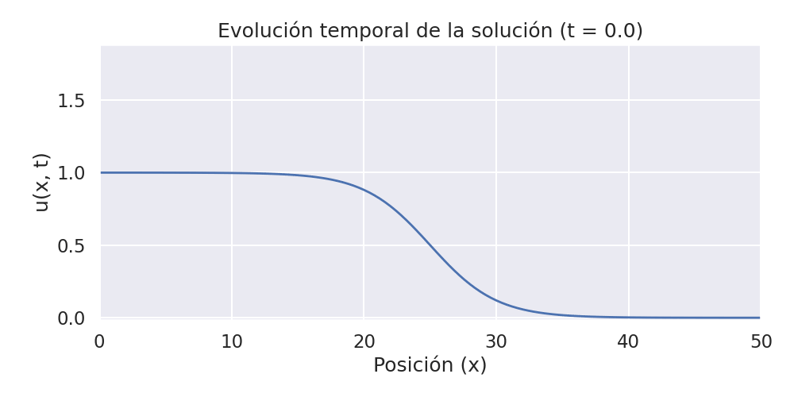
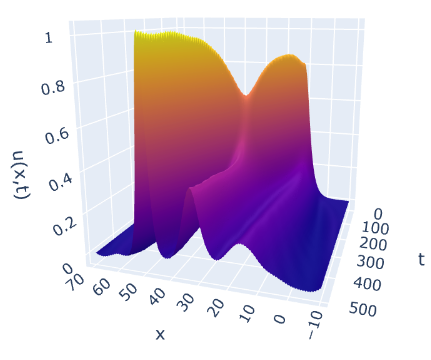
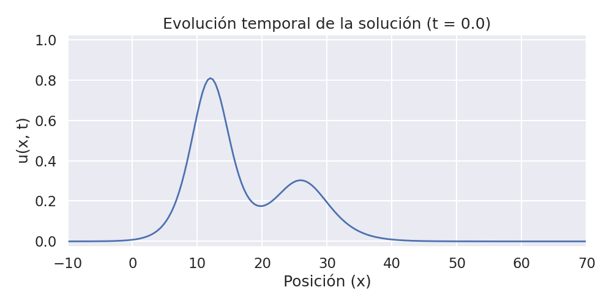

# Soliton Dynamics

This repository contains a Jupyter Notebook exploring solitons. It covers:  
- Derivation of governing equations and discussion of physical principles  
- Simulation techniques for solving nonlinear wave equations  
- Interactive plots and animations to illustrate soliton dynamics  

The notebook is divided into three main parts:

---

### 1. Analytical Solution  
The first part considers the analytical solution to the KdV equation for a single soliton.  

**Analytical result:**  
  

**Animated evolution:**  
  

---

### 2. Numerical Evolution of an Initial Step  
The second part investigates the evolution of an initial condition resembling a step.  

**Initial step profile:**  
  

**Numerical evolution:**  
  

---

### 3. Collision of Two Solitons  
The final part explores the nonlinear interaction and collision of two solitons.  

**Two-soliton initial condition:**  
  

**Collision dynamics:**  
  

---

## Requirements
- Python 3.x  
- Jupyter Notebook  
- Standard scientific libraries (`numpy`, `matplotlib`, etc.)

---

## How to Run
Clone the repository and open the notebook in Jupyter:  
```bash
git clone https://github.com/andresilvasquez/Solitons.git
cd Solitons
jupyter notebook

